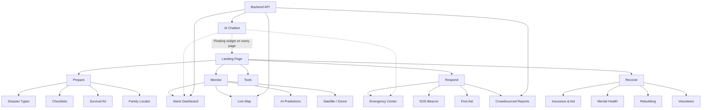
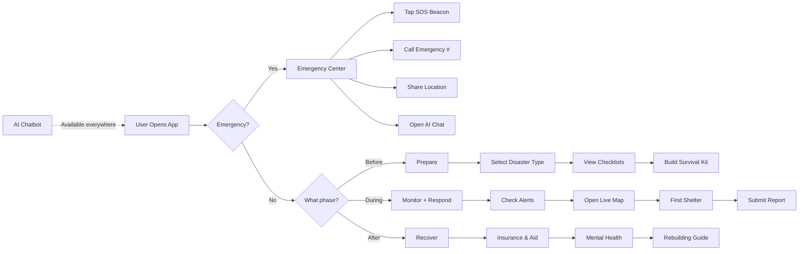

# SIH-india2025: Full Codebase Audit, Architecture & Rebuild Plan

## 1. Current State Assessment

### Verdict: **Full Rebuild Required**

The current codebase has grown organically into an unmaintainable monolith. Patching it further will only compound the problems. A clean rebuild with a modern framework is the correct approach.

---

### What Exists Today

| File | Lines | Size | Problem |
|------|-------|------|---------|
| `index.html` | 4,481 | 244 KB | **38 sections** crammed into one file, 3 duplicated sections |
| `script.js` | 5,971 | 220 KB | **290 functions** in one global namespace, no modularity |
| `styles.css` | 8,216 | 160 KB | One massive stylesheet, no design tokens or variables |
| `DESIGN.md` | - | - | **[NEW]** Comprehensive Design System Source of Truth |
| `stitch-prompts.md` | - | - | **[NEW]** Optimized prompts for UI generation |

**Backend** (`backend/`): Relatively clean Express 5 server with a single `/bot/v1/message` endpoint, OpenRouter/OpenAI integration, Zod validation, and MongoDB models. However:
- Models (`bot.model.js`, `user.model.js`) are minimal and have a typo (`timstamp`)
- No real data endpoints beyond the chatbot
- Models are not actually used in the controller

### Critical Problems

1. **No component architecture** — Everything lives in 3 giant files
2. **Duplicate HTML** — `alerts`, `live-updates`, `crowdsourced` sections appear twice in `index.html`
3. **No client-side routing** — 38 sections faked as "pages" via anchor links and scroll
4. **No state management** — Global variables scattered across `script.js`
5. **No real data** — All maps, alerts, shelters, and reports are hardcoded mocks
6. **No build tooling** — No bundler, no linting, no type checking
7. **No tests** — Despite test files existing, there's no actual test infrastructure
8. **CSS is unsustainable** — 8,000+ lines with no variables, no nesting, no theming
9. **Chatbot logic duplicated** — Between `chatbot-popup.html`, `script.js`, and `mock-api.js`

---

## 2. All Current Sections (Mapped from `index.html`)

These 38 sections are what currently exist as inline `<section>` elements:

| # | Section ID | Purpose | Category |
|---|-----------|---------|----------|
| 1 | `home` | Hero landing | Landing |
| 2 | `disaster-selection` | Choose disaster type | Prepare |
| 3 | `checklists` | Pre/During/Post checklists | Prepare |
| 4 | `alerts` *(duplicated)* | Early warning alerts | Monitor |
| 5 | `live-updates` *(duplicated)* | Shelter, roads, fire, flood data | Monitor |
| 6 | `crowdsourced` *(duplicated)* | Community reports | Monitor |
| 7 | `predictions` | AI disaster predictions | Monitor |
| 8 | `map` | Live disaster map | Respond |
| 9 | `emergency-numbers` | Emergency phone numbers | Respond |
| 10 | `first-aid` | First aid instructions | Respond |
| 11 | `survival-kit` | Kit checklist | Prepare |
| 12 | `resource-finder` | Find nearby resources | Recover |
| 13 | `resources` | General resources | Tools |
| 14 | `family-locator` | Track family members | Prepare |
| 15 | `volunteer-aid` | Volunteer coordination | Recover |
| 16 | `multilingual` | Language selection | Tools |
| 17 | `accessibility` | Accessibility settings | Tools |
| 18 | `simulation-drill` | Emergency drill mode | Prepare |
| 19 | `educational-content` | Learning resources | Prepare |
| 20 | `ai-assistant` | AI chatbot interface | Core |
| 21 | `damage-report` | Report damage | Respond |
| 22 | `insurance-aid` | Insurance & financial aid | Recover |
| 23 | `mental-health` | Mental health resources | Recover |
| 24 | `drone-data` | Drone surveillance data | Monitor |
| 25 | `satellite-imagery` | Satellite data | Monitor |
| 26 | `ar-navigation` | AR navigation for evacuation | Respond |
| 27 | `hazard-prediction` | AI hazard forecasting | Monitor |
| 28 | `ai-risk-advisor` | Personalized risk advice | Monitor |
| 29 | `voice-activation` | Voice commands | Tools |
| 30 | `offline-translation` | Offline language translation | Tools |
| 31 | `sos-beacon` | Emergency SOS signal | Respond |
| 32 | `battery-saver` | Power conservation mode | Tools |
| 33 | `digital-id` | Digital identity card | Tools |
| 34 | `rebuilding` | Post-disaster rebuilding guide | Recover |
| 35 | `offline` | Offline mode settings | Tools |
| 36 | `emergency` | Emergency action panel | Respond |

---

## 3. Recommended Tech Stack

### Frontend — **Next.js 14 (App Router) + TypeScript**

| Layer | Technology | Why |
|-------|-----------|-----|
| **Framework** | Next.js 14 (App Router) | File-based routing, SSR/SSG, API routes, image optimization |
| **Language** | TypeScript | Type safety, better DX, catches bugs at compile time |
| **Styling** | Tailwind CSS + CSS Variables | Utility-first, design tokens via CSS variables, dark mode built-in |
| **UI Components** | shadcn/ui + Radix UI | Accessible, unstyled primitives + polished prebuilt components |
| **Maps** | Mapbox GL JS or Leaflet | Real interactive maps with layers, markers, heatmaps |
| **State** | Zustand | Lightweight, TypeScript-first state management |
| **Forms** | React Hook Form + Zod | Performant forms with schema validation (reuse backend schemas) |
| **Animations** | Framer Motion | Smooth page transitions, micro-interactions |
| **Icons** | Lucide React | Modern, consistent icon set (tree-shakeable) |
| **Charts** | Recharts | Data visualization for predictions, flood levels, etc. |
| **PWA** | next-pwa | Offline support, service worker, installable app |
| **i18n** | next-intl | Multi-language support (Hindi, English, regional languages) |

### Backend — **Keep Express, Expand API**

| Layer | Technology | Why |
|-------|-----------|-----|
| **Runtime** | Node.js 20+ | Already in use, stable |
| **Framework** | Express 5 (keep) | Already working, just needs more endpoints |
| **Database** | MongoDB + Mongoose (keep) | Already configured, add proper schemas |
| **AI** | OpenAI SDK via OpenRouter (keep) | Already working well |
| **Validation** | Zod (keep) | Already in use, share schemas with frontend |
| **Auth** | NextAuth.js | User accounts for family locator, saved checklists |
| **Real-time** | Socket.io or Server-Sent Events | Live alerts, shelter updates |
| **File Storage** | Cloudinary or S3 | Damage report images, drone data |

### DevOps & Tooling

| Tool | Purpose |
|------|---------|
| **ESLint + Prettier** | Code quality and formatting |
| **Vitest** | Unit and integration testing |
| **Playwright** | End-to-end browser testing |
| **GitHub Actions** | CI/CD pipeline |
| **Vercel** | Frontend deployment (free tier) |
| **Railway/Render** | Backend deployment (keep current) |

---

## 4. Proposed Architecture

### Page Structure (File-Based Routing)

```
app/
├── layout.tsx                    # Root layout (navbar, footer, theme)
├── page.tsx                      # Landing / Hero page
├── globals.css                   # Design tokens + base styles
│
├── prepare/
│   ├── page.tsx                  # Prepare overview
│   ├── disaster-types/page.tsx   # Select disaster type
│   ├── checklists/page.tsx       # Pre/During/Post checklists
│   ├── survival-kit/page.tsx     # Kit builder
│   ├── family-locator/page.tsx   # Family tracking
│   ├── drills/page.tsx           # Simulation drill mode
│   └── learn/page.tsx            # Educational content
│
├── monitor/
│   ├── page.tsx                  # Dashboard overview
│   ├── alerts/page.tsx           # Real-time alerts feed
│   ├── live-updates/page.tsx     # Shelter, roads, conditions
│   ├── predictions/page.tsx      # AI hazard predictions
│   ├── map/page.tsx              # Interactive disaster map
│   ├── satellite/page.tsx        # Satellite imagery
│   └── drone-data/page.tsx       # Drone surveillance
│
├── respond/
│   ├── page.tsx                  # Respond overview
│   ├── emergency/page.tsx        # Emergency action center
│   ├── sos/page.tsx              # SOS beacon
│   ├── first-aid/page.tsx        # First aid guides
│   ├── contacts/page.tsx         # Emergency numbers
│   ├── damage-report/page.tsx    # Report damage with photos
│   ├── crowdsourced/page.tsx     # Community reports
│   └── ar-navigation/page.tsx    # AR evacuation routes
│
├── recover/
│   ├── page.tsx                  # Recovery overview
│   ├── insurance/page.tsx        # Insurance & aid info
│   ├── mental-health/page.tsx    # Mental health resources
│   ├── rebuilding/page.tsx      # Rebuilding guide
│   ├── volunteers/page.tsx       # Volunteer coordination
│   └── resources/page.tsx        # Resource finder
│
├── tools/
│   ├── settings/page.tsx         # App settings
│   ├── offline/page.tsx          # Offline mode
│   ├── accessibility/page.tsx    # Accessibility options
│   └── digital-id/page.tsx       # Digital ID card
│
├── chat/
│   └── page.tsx                  # AI chatbot (full page)
│
└── api/                          # Next.js API routes (proxy to backend)
    ├── chat/route.ts
    └── alerts/route.ts
```

### Component Architecture

```
components/
├── layout/
│   ├── Navbar.tsx                # Top navigation with mega-menu
│   ├── Sidebar.tsx               # Mobile sidebar navigation
│   ├── Footer.tsx                # Site footer
│   └── PageHeader.tsx            # Reusable section header
│
├── chat/
│   ├── ChatWidget.tsx            # Floating chat bubble (global)
│   ├── ChatWindow.tsx            # Chat conversation UI
│   └── ChatMessage.tsx           # Individual message component
│
├── maps/
│   ├── DisasterMap.tsx           # Main interactive map
│   ├── MapMarker.tsx             # Custom markers
│   └── MapLegend.tsx             # Map legend/key
│
├── alerts/
│   ├── AlertCard.tsx             # Individual alert
│   ├── AlertFeed.tsx             # Scrolling alert list
│   └── AlertBanner.tsx           # Top-of-page critical alert
│
├── checklists/
│   ├── ChecklistCard.tsx         # Checklist category
│   ├── ChecklistItem.tsx         # Single item with checkbox
│   └── ProgressRing.tsx          # Circular progress indicator
│
├── dashboard/
│   ├── StatsCard.tsx             # Metric card
│   ├── LiveIndicator.tsx         # Pulsing "Live" badge
│   └── CapacityBar.tsx           # Shelter capacity bar
│
└── ui/                           # shadcn/ui primitives
    ├── button.tsx
    ├── card.tsx
    ├── dialog.tsx
    ├── tabs.tsx
    └── ...
```

### Integration Flow



---

## 5. Core Features (Priority Order)

### P0 — Must Ship (MVP)

| Feature | Description |
|---------|-------------|
| **AI Chatbot** | Floating widget on every page, full-page chat view, OpenRouter integration |
| **Disaster Map** | Interactive Mapbox/Leaflet map with real shelter, hazard, and evacuation markers |
| **Alerts System** | Real-time alert feed with push notifications (SSE from backend) |
| **Emergency Center** | One-tap emergency contacts, SOS beacon, location sharing |
| **Checklists** | Interactive pre/during/post disaster checklists with localStorage persistence |
| **Offline Mode** | PWA with service worker, cached essential pages and data |

### P1 — High Priority

| Feature | Description |
|---------|-------------|
| **Live Updates Dashboard** | Shelter capacity, road closures, flood levels with live indicators |
| **Crowdsourced Reports** | Submit and view community reports with location and photos |
| **AI Predictions** | Hazard prediction cards with confidence levels and charts |
| **First Aid Guides** | Searchable, illustrated first aid instructions |
| **Multi-language** | Hindi + English + regional languages via next-intl |

### P2 — Nice to Have

| Feature | Description |
|---------|-------------|
| **Family Locator** | Share location with family members (requires auth) |
| **Damage Report** | Photo-based damage submission with GPS tagging |
| **Satellite/Drone** | Display imagery (requires external data API) |
| **AR Navigation** | Camera-based evacuation routing (requires WebXR) |
| **Simulation Drill** | Timed emergency drill mode with scoring |
| **Digital ID** | Offline-accessible emergency identification card |

---

## 6. User Flow



---

## 7. Aesthetics & Design System

### Visual Mood: **Command Center Dark**

A blend of **military command center** precision with **modern SaaS** polish. Think Bloomberg Terminal meets emergency services dashboard — authoritative, data-rich, but accessible.

> [!IMPORTANT]
> The design must feel **trustworthy and urgent** simultaneously. Users accessing this during a disaster need clarity, not decoration.

### Color Palette

| Role | Color | Hex | Usage |
|------|-------|-----|-------|
| **Background** | Deep Charcoal | `#0f1419` | App background, command center feel |
| **Surface** | Slate Gray | `#1a2332` | Cards, panels, containers |
| **Surface Elevated** | Steel Blue | `#243447` | Hover states, active cards |
| **Primary** | Safety Orange | `#ff6b35` | CTAs, emergency actions, SOS |
| **Secondary** | Electric Teal | `#00d4aa` | Success states, safe zones, confirmed reports |
| **Accent** | Signal Blue | `#3b82f6` | Links, info, map markers |
| **Critical** | Alert Red | `#ef4444` | Critical alerts, danger zones |
| **Warning** | Caution Amber | `#f59e0b` | Warnings, moderate alerts |
| **Info** | Sky Blue | `#38bdf8` | Information, tips |
| **Text Primary** | White | `#f1f5f9` | Headings, primary text |
| **Text Secondary** | Cool Gray | `#94a3b8` | Body text, labels |
| **Text Muted** | Dim Gray | `#64748b` | Timestamps, metadata |

### CSS Variable Tokens

```css
:root {
  /* Backgrounds */
  --bg-base: #0f1419;
  --bg-surface: #1a2332;
  --bg-elevated: #243447;
  --bg-overlay: rgba(15, 20, 25, 0.8);

  /* Brand */
  --color-primary: #ff6b35;
  --color-secondary: #00d4aa;
  --color-accent: #3b82f6;

  /* Status */
  --color-critical: #ef4444;
  --color-warning: #f59e0b;
  --color-success: #00d4aa;
  --color-info: #38bdf8;

  /* Text */
  --text-primary: #f1f5f9;
  --text-secondary: #94a3b8;
  --text-muted: #64748b;

  /* Borders */
  --border-subtle: rgba(148, 163, 184, 0.1);
  --border-default: rgba(148, 163, 184, 0.2);

  /* Shadows */
  --shadow-sm: 0 1px 3px rgba(0, 0, 0, 0.3);
  --shadow-md: 0 4px 12px rgba(0, 0, 0, 0.4);
  --shadow-lg: 0 8px 32px rgba(0, 0, 0, 0.5);
  --shadow-glow-primary: 0 0 20px rgba(255, 107, 53, 0.3);
  --shadow-glow-critical: 0 0 20px rgba(239, 68, 68, 0.4);

  /* Radii */
  --radius-sm: 6px;
  --radius-md: 10px;
  --radius-lg: 16px;
  --radius-full: 9999px;

  /* Transitions */
  --transition-fast: 150ms ease;
  --transition-base: 250ms ease;
  --transition-slow: 400ms cubic-bezier(0.4, 0, 0.2, 1);
}
```

### Typography

| Element | Font | Weight | Size |
|---------|------|--------|------|
| **Headings** | `Inter` | 700 (Bold) | 2.5rem → 1.25rem |
| **Body** | `Inter` | 400 (Regular) | 1rem (16px) |
| **UI Labels** | `Inter` | 500 (Medium) | 0.875rem (14px) |
| **Data/Numbers** | `JetBrains Mono` | 500 | 1rem — for stats, gauges, IDs |
| **Small/Meta** | `Inter` | 400 | 0.75rem (12px) |

### Visual Principles

1. **Glassmorphism for cards** — `backdrop-filter: blur(12px)` with semi-transparent backgrounds
2. **Glow effects for urgency** — Critical alerts get a red glow (`box-shadow: 0 0 20px rgba(239, 68, 68, 0.4)`)
3. **Pulsing indicators** — Live data gets animated pulse dots (teal for normal, red for critical)
4. **Smooth transitions** — All state changes animated with `transition: all 250ms ease`
5. **Data density** — Dashboard-style layouts with compact cards showing key metrics
6. **Responsive grid** — CSS Grid with `auto-fit, minmax(300px, 1fr)` for adaptive layouts
7. **Micro-animations** — Framer Motion for page transitions, card hover lifts, skeleton loading

### Alert Severity Styling

```
┌──────────────────────────────────────────┐
│ 🔴 CRITICAL  — Red glow, pulsing border  │
│ 🟡 WARNING   — Amber left-border accent  │
│ 🔵 INFO      — Blue left-border accent    │
│ 🟢 SUCCESS   — Teal left-border accent    │
└──────────────────────────────────────────┘
```

---

## 8. Verification Plan

### Automated Tests
- **Vitest** — Unit tests for utility functions, API handlers, Zod schemas
- **Playwright** — E2E tests for critical flows: chatbot interaction, checklist persistence, emergency contacts, navigation
- Run with: `npm run test` (unit) and `npx playwright test` (E2E)

### Manual Verification
1. Open the app in browser and navigate through all 5 top-level sections
2. Test chatbot by sending "earthquake safety" and verifying AI response
3. Toggle offline mode and verify cached pages load
4. Test on mobile viewport (375px) for responsive layout
5. Verify dark theme renders correctly with all color tokens

---

## Summary

> [!CAUTION]
> **The current codebase cannot be incrementally improved** — it must be rebuilt. The 18,000+ lines across 3 files with no modularity, no routing, and no component system make any further additions exponentially harder. A Next.js rebuild will give you proper pages, components, state management, and a path to scale.

**Estimated rebuild time**: 2–3 weeks for MVP (P0 features), 4–5 weeks for P1 features.
